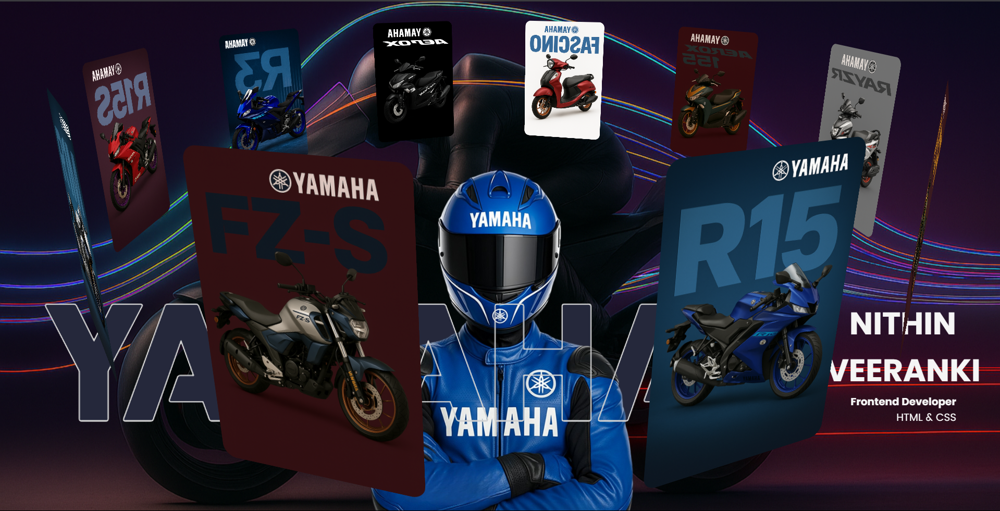

# 🏍️ Yamaha 3D Website

A 3D animated Yamaha bike showcase website designed using **HTML** and **CSS**. It features a rotating carousel of Yamaha bikes, smooth aesthetic transitions, stylish typography, and a racing-inspired background.

---

## 🔥 Features

- 🔄 3D animated image slider (bike carousel)
- 🎨 Custom racing-themed background image
- ✨ Smooth image borders and shadows
- 🖋️ Custom fonts using ICA Rubrik & Poppins
- 📱 Fully responsive layout
- 🌍 Deployable via GitHub Pages

---

## 🖼️ Preview

>  
> 

---

## 🚀 Live Demo

👉 **[Live Site on GitHub Pages](https://yamaha-webpage.vercel.app/)**

---

## 🗂️ Folder Structure
yamaha-website/
├── index.html
├── style.css
├── README.md
├── images/
│ ├── bg.png
│ ├── model.png
│ ├── bike1.png
│ ├── bike2.png
│ ├── ... up to bike10.png


---

## ⚙️ How to Run Locally
 **Clone the repository:**
   ```bash
   git clone https://github.com/nithinveeranki/YAMAHA-WEBPAGE.git
   cd yamaha-website
   Open index.html in any web browser (no server needed).

👤 Author
Nithin Veeranki
Frontend Developer

📧 [nithinveeranki@gmail.com]
💼 Portfolio:
   
